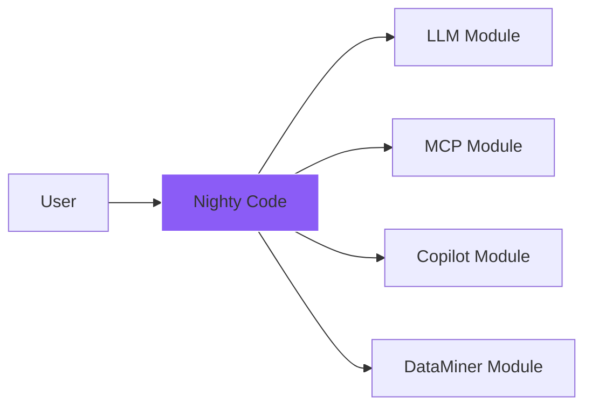
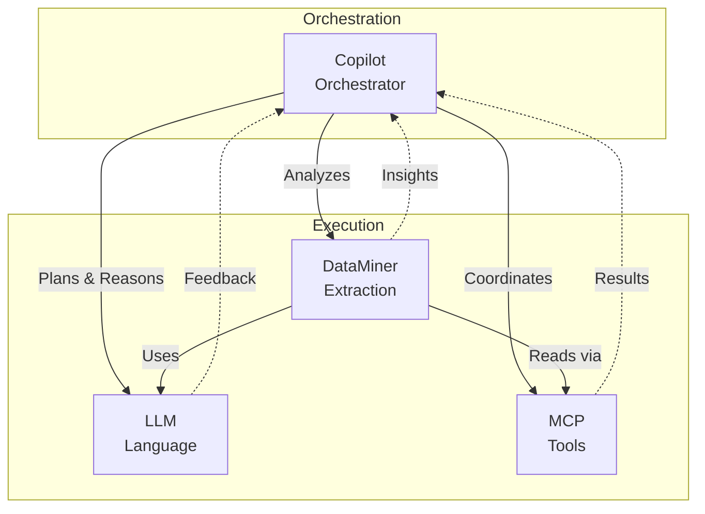

# Nighty Code - Design Concepts & Architecture

## 🎯 Vision

Nighty Code is designed as a **cognitive AI framework** that mimics human-like intelligence through modular, brain-inspired architecture. Each module represents a specialized cognitive function, working together to create sophisticated AI applications.

## 🧠 Core Philosophy

### Brain-Inspired Architecture
Our system is modeled after the human brain's architecture:
- **Modular Specialization**: Each module handles specific cognitive functions
- **Neural Pathways**: Information flows through interconnected processing pipelines
- **Learning & Adaptation**: Systems improve through feedback and experience
- **Parallel Processing**: Multiple cognitive processes run simultaneously
- **Memory Systems**: Short-term and long-term memory for context preservation

## 📊 Visual Architecture Diagrams

### System Overview


### Detailed Diagrams
- **[LLM Module Flow](docs/diagrams/llm_module.mmd)** - Request processing pipeline
- **[MCP Module Architecture](docs/diagrams/mcp_module.mmd)** - Tool and resource management
- **[Copilot Brain Design](docs/diagrams/copilot_brain.mmd)** - Cognitive processing architecture
- **[DataMiner Cognitive Flow](docs/diagrams/dataminer_cognitive.mmd)** - Intelligent extraction pipeline
- **[System Architecture](docs/diagrams/system_architecture.mmd)** - Complete system overview

## 🧩 Module Concepts

### 1. LLM Module - The Communication Cortex
**Concept**: Universal language processing center

**Design Pattern**: Pipeline Architecture
```
Input → Manager → Middleware Pipeline → Providers → Output
```

**Key Features**:
- **Multi-Provider Abstraction**: Seamlessly switch between AI providers
- **Middleware Pipeline**: Composable processing layers (retry, rate limit, metrics)
- **Connection Pooling**: Efficient resource management
- **Structured Output**: Type-safe responses with Pydantic

**Input/Output**:
- **Input**: Messages, optional schema, configuration
- **Output**: Text response, structured data, or token stream

**Real-World Analogy**: Like a universal translator with quality control, the LLM module ensures reliable communication with any AI provider while maintaining consistency and safety.

---

### 2. MCP Module - The Motor Cortex
**Concept**: Action execution and environment interaction

**Design Pattern**: Server-Client Architecture with Tool Registry
```
Tool Call → Manager → Server Selection → Execution → Result
```

**Key Features**:
- **Tool Abstraction**: Unified interface for diverse operations
- **Security Sandbox**: Safe execution with access controls
- **Resource Management**: Files, prompts, and metadata handling
- **Extensible Servers**: Easy addition of new capabilities

**Input/Output**:
- **Input**: Tool calls with parameters
- **Output**: Execution results, resources, or errors

**Real-World Analogy**: Like the motor cortex controlling muscles, MCP translates intentions into concrete actions in the digital environment.

---

### 3. Copilot Module - The Prefrontal Cortex
**Concept**: Executive function and high-level reasoning

**Brain-Like Design**:
```
🧠 Cognitive Architecture:
┌─────────────────────────────────────┐
│  Prefrontal Cortex (Planning)       │
├─────────────────────────────────────┤
│  Temporal Lobe (Memory)             │
├─────────────────────────────────────┤
│  Parietal Lobe (Tool Integration)   │
├─────────────────────────────────────┤
│  Limbic System (Safety/Emotions)    │
├─────────────────────────────────────┤
│  Cerebellum (Coordination)          │
└─────────────────────────────────────┘
```

**Cognitive Process Flow**:
1. **Perception**: Understand user intent and context
2. **Reasoning**: Apply logical analysis and planning
3. **Memory Consolidation**: Store and retrieve relevant information
4. **Decision Making**: Evaluate options and select actions
5. **Execution**: Coordinate tools and generate responses
6. **Reflection**: Analyze quality and learn from outcomes

**Input/Output**:
- **Input**: Natural language queries, context, signals
- **Output**: Reasoned responses, executed workflows, learned patterns

**Real-World Analogy**: Like a skilled assistant with perfect memory, Copilot thinks through problems, remembers past interactions, and coordinates multiple tools to achieve complex goals.

---

### 4. DataMiner Module - The Visual/Pattern Cortex
**Concept**: Pattern recognition and information extraction

**Cognitive Extraction Pipeline**:
```
Discovery → Extraction → Synthesis → Validation
    ↑           ↓           ↓           ↓
Learning ← Feedback ← Quality Analysis
```

**Multi-Strategy Approach**:
- **Simple Strategy** ⚡: Fast, single-pass extraction
- **Multi-Stage Strategy** 🔄: Progressive refinement
- **Cognitive Strategy** 🧠: Reasoning-guided extraction
- **Reflective Strategy** 🔁: Iterative improvement

**Intelligence Features**:
- **Pattern Memory**: Learns successful extraction patterns
- **Adaptive Control**: Auto-tunes strategies based on performance
- **Gap Analysis**: Identifies and fills missing information
- **Confidence Scoring**: Multi-dimensional quality assessment

**Input/Output**:
- **Input**: Unstructured content, target schema, configuration
- **Output**: Structured data with confidence metrics and gap analysis

**Real-World Analogy**: Like an expert analyst who can read any document and extract exactly the information you need, learning from each extraction to get better over time.

## 🔄 Inter-Module Communication

### Communication Patterns



### Example Workflows

#### 1. Code Analysis Workflow
```
User Request → Copilot (Planning) → MCP (Read Files) → 
DataMiner (Extract Structure) → LLM (Analyze) → 
Copilot (Synthesize) → Response
```

#### 2. Document Generation Workflow
```
User Query → DataMiner (Gather Info) → Copilot (Organize) → 
LLM (Generate) → Copilot (Review) → MCP (Write) → Output
```

#### 3. Interactive Debugging
```
Bug Report → Copilot (Understand) → MCP (Read Code) → 
DataMiner (Find Patterns) → LLM (Suggest Fix) → 
Copilot (Validate) → Solution
```

## 🎨 Design Principles

### 1. **Modularity**
Each module is self-contained with clear interfaces, allowing independent development and testing.

### 2. **Composability**
Modules can be combined in various ways to create complex workflows without tight coupling.

### 3. **Intelligence Amplification**
Rather than replacing human intelligence, the system amplifies it through cognitive assistance.

### 4. **Progressive Enhancement**
Start with simple operations and progressively add complexity through strategy selection.

### 5. **Fail-Safe Design**
Multiple fallback mechanisms ensure graceful degradation rather than complete failure.

### 6. **Learning & Adaptation**
Systems improve through use, learning from successes and failures.

## 🚀 Use Case Patterns

### Pattern 1: Cognitive Assistant
```python
# Combines all modules for comprehensive assistance
copilot = CopilotWorkflow()
result = await copilot.assist("Help me refactor this codebase")
# Uses: Reasoning → File Reading → Code Analysis → Suggestions → Implementation
```

### Pattern 2: Intelligent Extraction
```python
# Extract structured data from any content
miner = DataMinerClient()
schema = ProjectInfo
result = await miner.extract(repository_path, schema)
# Uses: Multi-stage extraction with confidence scoring
```

### Pattern 3: Tool Orchestration
```python
# Coordinate multiple tools for complex tasks
mcp = MCPManager()
await mcp.execute_workflow([
    ("read", "requirements.txt"),
    ("analyze", "dependencies"),
    ("generate", "upgrade plan"),
    ("write", "upgrade_plan.md")
])
```

### Pattern 4: Conversational AI
```python
# Natural interaction with memory and context
session = InteractiveSession()
await session.chat("Let's design a new feature")
# Maintains context across multiple turns
```

## 🔮 Future Enhancements

### Planned Cognitive Capabilities
1. **Imagination Module**: Generate creative solutions and scenarios
2. **Intuition Layer**: Pattern-based quick decisions
3. **Emotion Simulation**: Understand and respond to emotional context
4. **Dream State**: Background processing and connection finding

### Technical Roadmap
- **Distributed Processing**: Scale across multiple machines
- **Neural Network Integration**: Custom ML models for specific tasks
- **Knowledge Graph**: Semantic relationship mapping
- **Quantum-Ready**: Prepared for quantum computing integration

## 📚 Learning Resources

### Understanding the Architecture
1. Study the [brain-inspired Copilot design](docs/diagrams/copilot_brain.mmd)
2. Explore the [cognitive extraction flow](docs/diagrams/dataminer_cognitive.mmd)
3. Review the [complete system architecture](docs/diagrams/system_architecture.mmd)

### Implementation Guides
- [LLM Module README](src/llm/README.md)
- [MCP Module README](src/mcp/README.md)
- [Copilot Module README](src/copilot/README.md)
- [DataMiner Module README](src/dataminer/README.md)

### Example Applications
- [Complete Examples](examples/)
- [Test Suite](test_examples.py)

## 🎯 Quick Decision Guide

| Need | Use Module | Key Feature |
|------|------------|-------------|
| Call any LLM | LLM | Multi-provider support |
| Execute tools | MCP | Safe sandboxed execution |
| Complex reasoning | Copilot | Cognitive workflows |
| Extract structured data | DataMiner | Multi-strategy extraction |
| Conversation with memory | Copilot | Session management |
| File operations | MCP | Filesystem server |
| Retry & rate limiting | LLM | Middleware pipeline |
| Schema validation | DataMiner | Pydantic integration |

## 🏗️ Architecture Best Practices

### 1. Start Simple
Begin with single modules and gradually combine them as needed.

### 2. Use Appropriate Strategies
- **Fast Mode**: For simple, well-structured content
- **Thorough Mode**: For complex, ambiguous content
- **Cognitive Mode**: When reasoning is required

### 3. Monitor Confidence
Always check confidence scores and gap analysis for quality assurance.

### 4. Enable Learning
Allow modules to learn from interactions for continuous improvement.

### 5. Layer Security
Use guardrails, rate limiting, and access controls at multiple levels.

## 🌟 Conclusion

Nighty Code represents a new paradigm in AI development - a truly cognitive framework that thinks, learns, and adapts like a human brain. By combining specialized modules through brain-inspired architecture, we create AI systems that are not just powerful, but genuinely intelligent.

The modular design ensures that each component can evolve independently while maintaining seamless integration. Whether you're building a simple chatbot or a complex cognitive assistant, Nighty Code provides the foundation for creating AI that truly understands and assists.

---

*"Intelligence is not just about processing information - it's about understanding, reasoning, and adapting. Nighty Code brings these cognitive capabilities to your applications."*